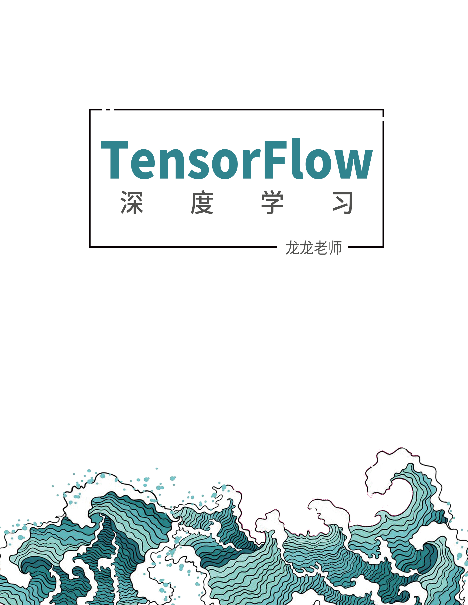
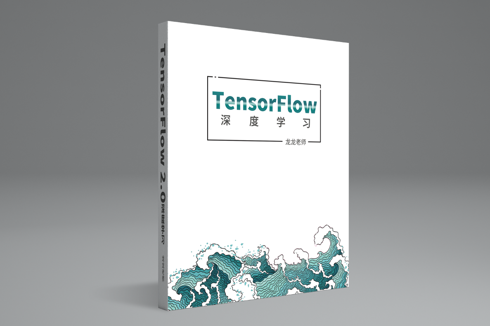
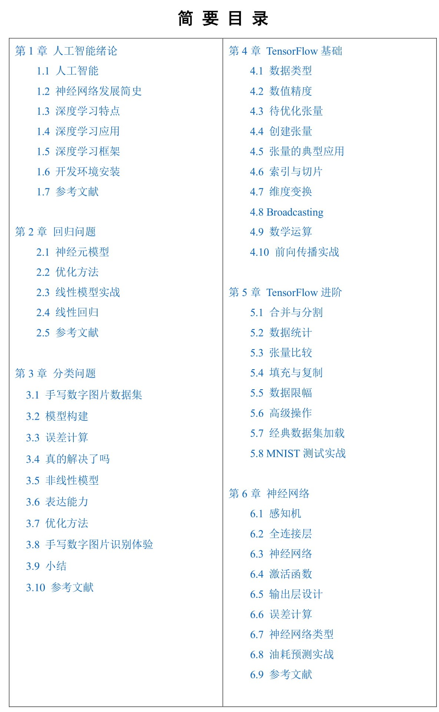
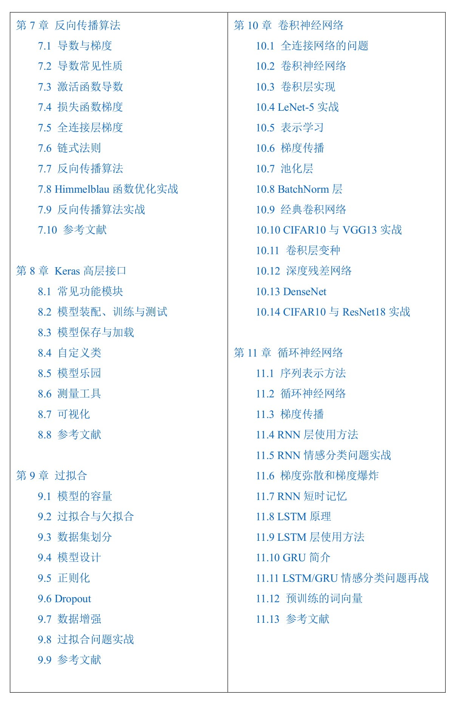
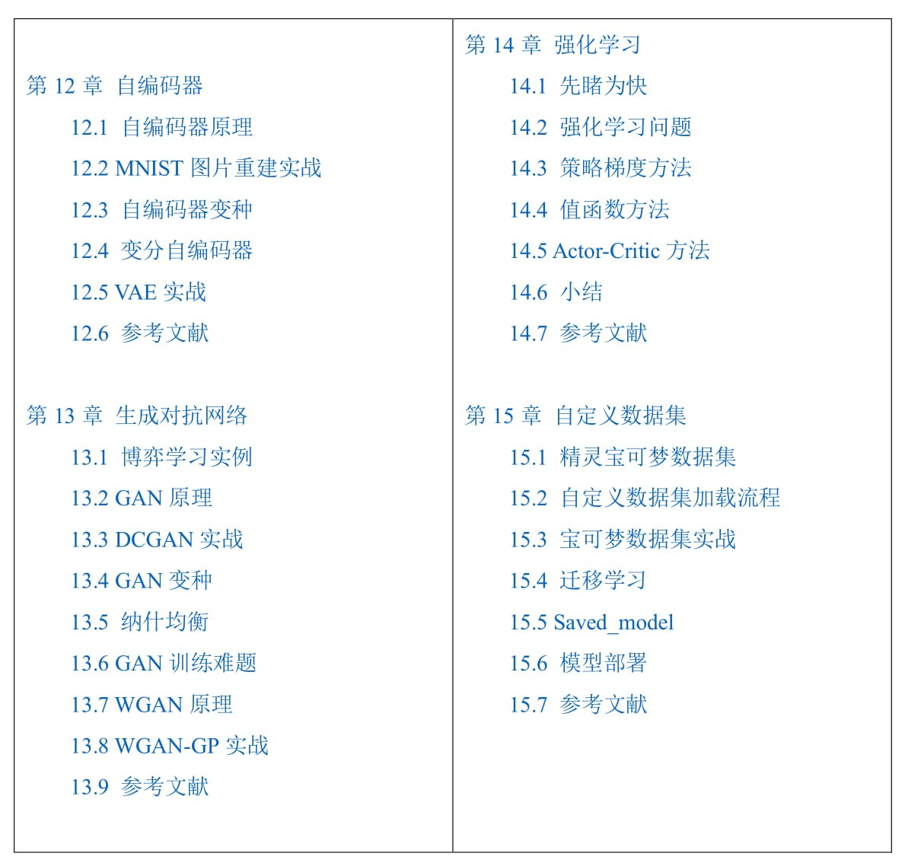

# TensorFlow 2.0深度学习开源书

基于TensorFlow 2.0正式版！！！

包含电子书，配套源代码等，时间仓促，源代码还没有整理完全~~

**有愿意将本书转化为PyTorch版本的朋友可以邮件联系我，可以合著出版！**

-  **本书被“机器之心”，“量子位”等权威媒体报导！**
-  **本库在Github趋势日榜单连续多天全球排名第1！**

>主页上方有个“Clone or Download”绿色按钮，下载整个仓库即可。之所以显示在线打不开是因为Github在国外，连接不稳定就会提示打不开。

  
  

-	提交错误或者修改等反馈意见，请在Github Issues页面提交：

https://github.com/dragen1860/Deep-Learning-with-TensorFlow-book/issues

-	TensorFlow 2.0 实战案例：
https://github.com/dragen1860/TensorFlow-2.x-Tutorials

-	联系邮箱(一般问题建议Github issues交流)：liangqu.long AT gmail.com

- 使用本书本的任何内容时(仅限个人的非商业用途)，请注明作者和Github链接

# 介绍短视频

https://www.bilibili.com/video/av75331861

# 目录

  
  
  

# 初学者交流QQ群

- 人工智能101学院-免费2群：535205236

- 人工智能101学院-免费1群：295208768(已满)

#	配套视频课程

收费，适合零基础、希望快速入门AI的朋友，提供答疑、指导等全方位服务。

- 深度学习与TensorFlow入门实战
https://study.163.com/course/courseMain.htm?share=2&shareId=480000001847407&courseId=1209092816&_trace_c_p_k2_=9e74eb6f891d47cfaa6f00b5cb5f617c
- 深度学习与PyTorch入门实战
https://study.163.com/course/courseMain.htm?share=2&shareId=480000001847407&courseId=1208894818&_trace_c_p_k2_=8d1b10e04bd34d69855bb71da65b0549

